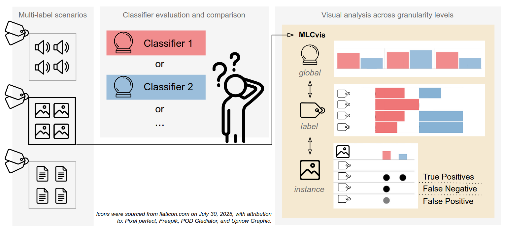

# MLCvis
Prototype for evaluating and comparing multi label classifiers.

Paper submitted at:

## Installation
Just open the `convis.html` file in a browser or copy it to a webserver. No backend required.

## Try it out!
Load the files in `Example/` as instructed by the interface.

## How do I use my own data?
Take a look at `Example/` directory and adapt your data. You need:
* A list of labels like in `Examples/categories.csv`
* Ground truth with ID, title, and label vector. The title is used to access the image files located in `RawData/` in this example.
* Prediction files: Array of binary label vectors.
* To provide a preview of your data, you need to modify `js/comparisonBlocks.js`

